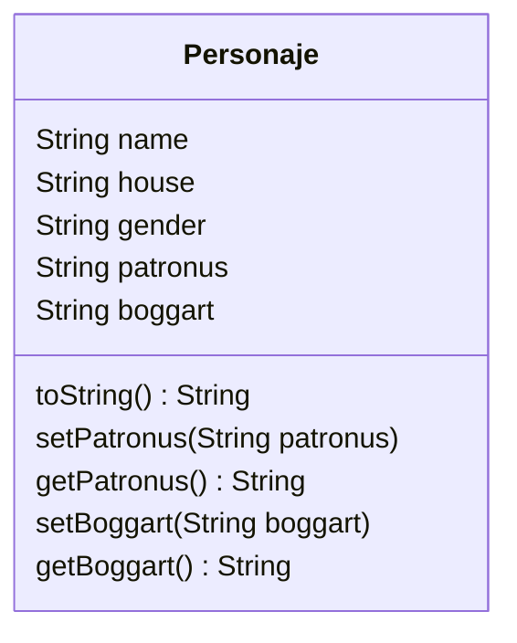

# 1. Modelado 🧙‍♂️

```mermaid
classDiagram

class Personaje{
  String name
  String house
  String gender
  String patronus
  String boggart
  
  toString() String
  setPatronus(String patronus)
  getPatronus() String
  setBoggart(String boggart)
  getBoggart() String
}


```
