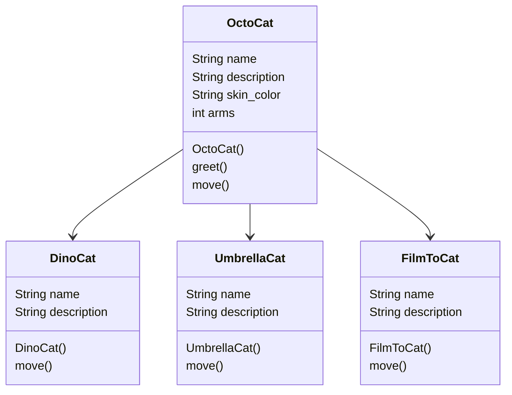

# 2. Herencia :octocat:

```mermaid
classDiagram

class OctoCat{
  String name
  String description
  String skin_color
  int arms
  
  OctoCat()
  greet()
  move()
}

class DinoCat{
  String name
  String description
  
  DinoCat()
  move()
}

class UmbrellaCat{
  String name
  String description
  
  UmbrellaCat()
  move()
}

class FilmToCat{
  String name
  String description
  
  FilmToCat()
  move()
}

OctoCat-->DinoCat
OctoCat-->UmbrellaCat
OctoCat-->FilmToCat

```
